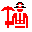
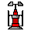
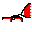

# smite
This is the [Battlecode 2020](https://battlecode.org) repository of team smite. We placed second in the final tournament.

# Overview
[Battlecode](https://battlecode.org) is a three-week-long AI competition run by MIT students during [IAP](https://web.mit.edu/iap/) every January. The competition changes every year, but the premise stays the same: two teams of robots facing off on a map. You program robots to move, attack and communicate to make sure your team survives and the other doesn't. Teams face off in tournaments every week, culminating in a double-elimination final tournament held at MIT in early February.

This year, Battlecode required teams to battle the terrain just as much as they battled each other. Combat was de-emphasized in favor or an environmental foe---water. Throughout the game, the water level rose---starting at elevation 0, and rising slowly at first but grew rapidly---and eventually consumed the entire map. If your units flooded, then they would die. You lose the game when your headquarters flood.

[Insert Game Screenshot here]

## Units

Robots in Battlecode move and fight. Miners and landscapers move on the ground, so they can only move to adjacent tiles of similar height. Drones fly, so they can quickly traverse treacherous terrain. If a robot moves into water (or its location gets flooded), it dies. The robots for Battlecode 2020 were:

Miner            | Landscaper | Drone
:-------------------------:|:-------------------------:|:-------------------------:
  |   |  

- **Miner**: They mine soup, the game's primary resource. Miners can be built only by the HQ. Miners leave the HQ, search for soup, mine it from tiles on the map, and return it to refineries. Soup is needed to build robots and buildings. If you don't get soup early with decent mining code, you'll lose.
- **Landscaper**: Landscapers change the elevation of the map. They can dig from any unoccupied tile on the map, and they can deposit anywhere. Landscapers can attack buildings. If they deposit enough dirt on a building, the building gets buried, and is dead. It can produce no more. They are also used for defense. You can use landscapers to build a wall around your HQ. This prevents the water from flooding your HQ early, because the briny seas must rise above your wall's height before they are able to desecrate your hallowed grounds.
- **Drone**: Drones can fly over the map; they are not encumbered by terrain changes. Drones can pick up units and drop them wherever they like. So, drones were primarily used to attack enemy robots by picking them up and dropping them in water. Some teams used drones to make their pathfinding easier; they picked up allied miners/landscapers and placed them as needed. We did not use this, as our pathfinding was slow and we dealt with it as real programmers should---by accepting our fate and timing out.

Buildings are immobile. Once they are built at a certain elevation, they remain there for the entire game. So, buildings can die if a landscaper buries them or the flood level rises to their height. The buildings for Battlecode 2020 were:

Headquarters            | Design School | Drone Factory | Refinery | Vaporator | Net Gun
:-------------------------:|:-------------------------:|:-------------------------:|:-------------------------:|:-------------------------:|:-------------------------:
  |   |   |  |  | 

- **Headquarters**: Your base. If your HQ dies, your game is over. The HQ produces miners. It also has refinery and a net gun built in.
- **Design School**: Produces landscapers. Built by miners. Can be used offensively (build near enemy) so you can produce landscapers which bury the opponent,  or defensively, so you can produce landscapers near your HQ to defend it.
- **Drone Factory**: Builds drones. You only need one, since you can spit out a drone every turn, and you don't need more than 150 drones even late-game.
- **Refinery**: Refines soup. Soup carried by miners must be deposited at a refinery. The refinery automatically refines the soup, and then adds it to your global soup store which can be drawn from to build items.
- **Vaporator**: Vaporized soup. Every vaporator you build adds to *x* soup to your team's store every round. Teams soon realized these were extremely powerful, and built a billion and a half of them before they were nerfed. Even then, they were still a worthwhile investment. Most finalists built at least 10 vaporators, and some more than 20 in a typical game.
- **Net Gun**: Shoots down drones. Your only protection against drones, but a pretty good one. Can shoot down a drone every turn, and have a large shooting radius so as soon as a drone sees the gun, its dead. Attackers needed a Drone : Opponent Net Gun ratio of 10:1 or more (if the defense has additional suppourt) to guarantee a successful attack.

## Resources
The main resource of Battlecode 2020 was soup! At each turn, teams gained soup, but they could also mine soup by sending miners to soup tiles on the map. Teams could also build vaporators to increase their soup income per round. Soup was used for constructing buildings and producing robots. In the end, ultra-efficient HQ-miner high-precision soup mining didn't matter much because building vaporators mid-game brought in a ton passive income. Building vaporators early was like printing money.

## Strategy
Our final strategy was to terraform the area surrounding our headquarters before building up our floodwalls. We then built drones to form a defensive shell and attack the enemy at certain rounds. Although this strategy seems fairly intuitive and balanced, we didn't start off with this plan.

### Sprint Tournament
We started the Sprint Tournament by building a rush bot.

### Seeding Tournament
For the seeding tournament, we focused on a bot which built a dense set of walls in a hashtag shape around our HQ. We also built out most of our core functionality in harvesting and had basic code for drones. We ended up winning largely because our hashtag was very robust to complex map scenarios involving difficult terrain near our HQ. However, it was clear more aggressive strategies were doing well, and the writing was on the wall that this would not work.

### Qualifying Tournament
We ended up changing our Seeding bot quite a bit.

### Final Tournament
We broke our bot in many ways, but made it better in others.

## Other Components

### Pathfinding
Our pathfinding was bad. We have always believed good pathfinding is key, and we designated a team member to work on just this for a week. It still was not great, and we really wish we had spent more time on this.

### Communication
Effective resource harvesting and communication has historically been key to battlecode. As a result, we invested a lot of early time into getting this right. Building on a system similar to last year, we discretized the board into 3x3 tiles. For each zone, we would report soup totals and if the enemy HQ was there, letting us keep an efficient game state at HQ. All messages were encrypted.

### Resource Collection
We spent a lot of time getting effective mining. Each miner had a base location where it would deposit soup. It also had a mining location from where it would harvest soup. Using a series of complicated switch based mechanices, we were able to efficiently scan for nearby soup and maintain a list of soup a miner had seen in its lifetime. At any given time, it would attempt to move towards the nearest tile filled with soup. Tiles were removed lazily, so when a miner was moving towards a tile, it would verify there was still soup there. This system allowed a miner to go to soup out of its vision which it had seen before.

Miners also communicated which tiles had soup in them. These were broadcasted by HQ every 5 turns, so miners had common knowledge on where soup was across the board and could tell each other to go to a soup tile they had seen. They also communicated whenever a tile was drained of soup so that miners wouldn't run across the board to chase ghost soup (as we did lazy deletion).

This turned out not to matter much as vaporators dominated and late game resource collection was pointless.

# To Run
Clone the [Battlecode 2020 Scaffold](https://github.com/battlecode/battlecode20-scaffold), install the JDK for Java 8 and run `./gradlew build` in the scaffold directory.

Then, clone this repository, and copy over the `src/` folder into the scaffold. To run games, open the client (a `client/` folder will appear once the `build` command has been run), and select the bots you wish to run. All bots can be found in the `src/` directory:

* `sprint/` was our submission for the Sprint tournament. We placed 3rd/4th (single elimination).
* `seeding2/` was our submission for the Seeding tournament. We placed 1st.
* `quail/` is not a copy of our submission for the Qualifying tournament, despite the commit message. It appears we don't have a copy currently in the repository, but [this folder from an earlier commit](https://github.com/mvpatel2000/Battlecode2020/tree/2eae1955bdb0ea8d9c4cc90e9a8a84013ea2d948/src/poseidon) was our submission.
* `qual/` was our Final tournament submission. Apologies for the misleading name.

The other folders are other versions we copied at some point for testing purposes. Notably, `hades/` beats our final submission far more often than it should. So does `quail/`.

# Previous Years
* [2019 submission](https://github.com/mvpatel2000/Battlecode2019) (1st)

