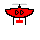

# smite
This is the [Battlecode 2020](https://battlecode.org) repository of team smite. We placed second in the final tournament.

## Overview
This year, Battlecode required teams to battle the terrain just as much as they battled each other. Combat was de-emphasized in favor or an environmental foe---water. Throughout the game, the water level rose---starting at elevation 0, and rising slowly at first but grew rapidly---and eventually consumed the entire map. If your units flooded, then they would die. You lose the game when your headquarter floods.

[Insert Game Screenshot here]

## Units
[Add unit icons]

Robots in Battlecode move and fight. Miners and landscapers move on the ground, so they can only move to adjacent tiles of similar height. Drones fly, so they can quickly traverse treacherous terrain. If a robot moves into water (or its location gets flooded), it dies. The robots for Battlecode 2020 were:

Miner            | Landscaper | Drone
:-------------------------:|:-------------------------:|:-------------------------:
  |   |  

- *Miner*: They mine soup, the game's primary resource. Miners can be built only by the HQ. Miners leave the HQ, search for soup, mine it from tiles on the map, and return it to refineries. Soup is needed to build robots and buildings. If you don't get soup early with decent mining code, you'll lose.
- *Landscaper*: Landscapers change the elevation of the map. They can dig from any unoccupied tile on the map, and they can deposit anywhere. Landscapers can attack buildings. If they deposit enough dirt on a building, the building gets buried, and is dead. It can produce no more. They are also used for defense. You can use landscapers to build a wall around your HQ. This prevents the water from flooding your HQ early, because the briny seas must rise above your wall's height before they are able to desecrate your hallowed grounds.
- *Drone*: Drones can fly over the map; they are not encumbered by terrain changes. Drones can pick up units and drop them wherever they like. So, drones were primarily used to attack enemy robots by picking them up and dropping them in water. Some teams used drones to make their pathfinding easier; they picked up allied miners/landscapers and placed them as needed. We did not use this, as our pathfinding was slow and we dealt with it as real programmers should---by accepting our fate and timing out.

Buildings are immobile. Once they are built at a certain elevation, they remain there for the entire game. So, buildings can die if a landscaper buries them or the flood level rises to their height. The buildings for Battlecode 2020 were:
- *Headquarters*: Your base. If your HQ dies, your game is over. The HQ produces miners. It also has refinery and a net gun built in.
- *Design School*: Produces landscapers. Built by miners. Can be used offensively (build near enemy) so you can produce landscapers which bury the opponent,  or defensively, so you can produce landscapers near your HQ to defend it.
- *Drone Factory*: Builds drones. You only need one, since you can spit out a drone every turn, and you don't need more than 150 drones even late-game.
- *Refinery*: Refines soup. Soup carried by miners must be deposited at a refinery. The refinery automatically refines the soup, and then adds it to your global soup store which can be drawn from to build items.

## Resources
The main resource of Battlecode 2020 was soup! At each turn, teams gained soup, but they could also mine soup by sending miners to soup tiles on the map. Teams could also build vaporators to increase their soup income per round. Soup is used for building buildings and producing robots. In the end, ultra-efficient HQ-miner coordinated precise soup mining didn't matter much because building enough vaporators mid-game brought in passive income. It's like gold rush, expect California in 1849 occurs is every single map at round 700.

## Strategy
Our final strategy was to terraform the area surrounding our headquarters before building up our floodwalls. We then built drones to form a defensive shell and attack the enemy at certain rounds. Although this strategy seems fairly intuitive and balanced, we didn't start off with this plan.

### Sprint Tournament
We started the Sprint Tournament by building a rush bot.

### Seeding Tournament
We didn't really get much done this week. Or maybe we did. I forget

### Qualifying Tournament
We ended up changing our Seeding bot quite a bit.

### Final Tournament
We broke our bot in many ways, but made it better in others.

## Other Components

### Pathfinding
Bad.

### Communication
Resources didn't matter, so neither did this.

## To Run
Clone the [Battlecode 2020 Scaffold](https://github.com/battlecode/battlecode20-scaffold), install the JDK for Java 8 and run `./gradlew build` in the scaffold directory.

Then, clone this repository, and copy over the `src/` folder into the scaffold. To run games, open the client (a `client/` folder will appear once the `build` command has been run), and select the bots you wish to run. All bots can be found in the `src/` directory:

* `sprint/` was our submission for the Sprint tournament. We placed 3rd/4th (single elimination).
* `seeding2/` was our submission for the Seeding tournament. We placed 1st.
* `quail/` is not a copy of our submission for the Qualifying tournament, despite the commit message. It appears we don't have a copy currently in the repository, but [this folder from an earlier commit](https://github.com/mvpatel2000/Battlecode2020/tree/2eae1955bdb0ea8d9c4cc90e9a8a84013ea2d948/src/poseidon) was our submission.
* `qual/` was our Final tournament submission. Apologies for the misleading name.

The other folders are other versions we copied at some point for testing purposes. Notably, `hades/` beats our final submission far more often than it should. So does `quail/`.

## Previous Years
* [2019 submission](https://github.com/mvpatel2000/Battlecode2019) (1st)

